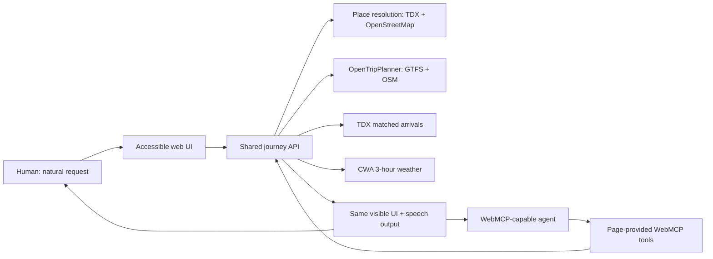

# Qianshou — Accessible Journey Companion

**An agent-native accessible journey companion for Taiwan.**


[Live app](https://loveyou.cradle-ai.dev/journey) · [繁體中文 README](README.md) · [WebMCP Challenge submission draft](docs/devpost-submission-en.md)

Qianshou means “holding hands” in Mandarin: accompanying someone through a journey without taking away their control. The Chinese name is **牽手過路走**.

Qianshou is designed for blind and older travelers who should not need to translate a real-world need into technical form fields. A person can say what they want naturally; a WebMCP-capable agent can prepare the trip through structured tools while the same result appears in a keyboard-accessible, readable, and speakable web interface.

The current pilot covers Taipei and New Taipei. It combines OpenTripPlanner, TDX transit data, OpenStreetMap place and street data, and Taiwan's Central Weather Administration forecasts. Missing accessibility data is kept explicitly **unknown** rather than presented as a safety guarantee.

## Why WebMCP matters here

Without WebMCP, an agent has to infer controls from pixels or ask a traveler to fill several precise fields. Qianshou exposes three purpose-built tools through `document.modelContext.registerTool`:

- `prepare_accessible_journey` accepts natural origin and destination references, resolves ambiguous places, requests fresh browser location only when needed, and prepares the route, matching arrival information, and short-range weather in one operation.
- `describe_current_location` requests a fresh one-time browser location and turns it into a human-readable nearby place without returning raw coordinates to the agent.
- `select_journey_alternative` switches the visible journey to an alternative already returned by the planner and refreshes arrival information for that route, without inventing a new option.

Every tool result also updates the visible page. This creates a shared workspace: the agent can do the structured work, while the person can inspect sources, select a place candidate, compare route alternatives, use the keyboard, or listen to the itinerary.

The user does not need to mention tool names. For example:

> 我想從臺大醫院去板橋車站，少走路、少轉乘，順便告訴我下一班車和未來幾小時的天氣。

> I want to go to Taipei 101.

> 從淡水到這裡。

> 這裡是哪裡？

## Human and agent flow



For typed requests, a loopback-only Codex CLI service converts the natural sentence into a validated JSON intent. Browser geolocation coordinates are never sent to that model. WebMCP tools use the same server-side journey preparation path as the manual UI, avoiding two inconsistent product experiences.

## Accessibility and safety boundaries

- One natural-language input instead of technical origin/destination controls.
- Fixed defaults favor less walking, fewer transfers, and avoidance of known stair markings.
- Keyboard focus management, skip link, live regions, reduced-motion support, responsive layout, and speech synthesis.
- At most two transfers are considered.
- Current location is requested once per relevant action with `maximumAge: 0`; stale or low-quality fixes are rejected.
- Exact current-location coordinates are removed from WebMCP results and are not stored in analytics.
- GTFS and OpenStreetMap accessibility gaps remain labelled unknown. Qianshou does not claim that an unknown segment is step-free.

This pilot has not yet completed formal testing with blind participants. The repository includes a target-user usability plan and a data-coverage report so that product claims remain narrower than the evidence.

## Data and privacy

The page records a session-scoped interaction trail to support product evaluation. It stores submitted questions, the system's understood summary, intent classification, and major UI/WebMCP events for 30 days by default. It does not record unsubmitted keystrokes, audio, or coordinates returned by the browser geolocation API. A user can stop recording or delete the current session from the page footer.

If a person types an address or coordinate directly into a submitted question, that submitted text is stored as written. The analytics database is server-only, has no public read endpoint, and is created with service-account-only file permissions.

## Technology

- Next.js 16.3, React 19, TypeScript
- Native WebMCP `document.modelContext.registerTool`
- Codex CLI structured intent service
- OpenTripPlanner 2.9
- TDX GTFS and real-time transit APIs
- OpenStreetMap and Nominatim
- Taiwan Central Weather Administration open data
- Node.js SQLite for low-overhead, session-scoped product analytics

## Run locally

Requirements: Node.js 22+, pnpm 11+, Docker, and a logged-in Codex CLI.

```bash
corepack pnpm install
cp .env.example .env.local
```

Add server-side credentials to `.env.local` when official data is required:

```dotenv
TDX_CLIENT_ID=
TDX_CLIENT_SECRET=
CWA_API_KEY=
```

Start the intent service:

```bash
node services/intent-backend/server.mjs
```

Start the web app in another terminal:

```bash
corepack pnpm dev
```

Open `http://localhost:3000`. Building the complete transit graph requires the additional steps in [docs/otp-local.md](docs/otp-local.md).

## Verify

```bash
corepack pnpm typecheck
corepack pnpm test
corepack pnpm build
```

The deployed app should be tested with ChatGPT's in-app browser or Chrome with WebMCP testing enabled. A native smoke test should confirm that the agent calls the page-provided tool—not a simulated form interaction—and that the visible page updates after the call.

## Repository map

- [`src/lib/webmcp/register-tools.ts`](src/lib/webmcp/register-tools.ts): native WebMCP tool registration and execution
- [`src/lib/server/journey-service.ts`](src/lib/server/journey-service.ts): shared orchestration for place, route, arrivals, and weather
- [`services/intent-backend`](services/intent-backend): sandboxed natural-language intent service
- [`infra/otp`](infra/otp): GTFS/OSM ingestion and OpenTripPlanner configuration
- [`docs/accessibility-data-coverage.md`](docs/accessibility-data-coverage.md): evidence-based accessibility claims
- [`docs/usability-test-plan.md`](docs/usability-test-plan.md): target-user validation plan

## Hackathon provenance

The repository was created during the WebMCP Challenge submission period. The first commit is dated August 29, 2026, after the challenge opened on August 25, 2026. See [the development evidence](docs/hackathon-evidence.md).

## License and acknowledgements

Code in this repository is released under the [MIT License](LICENSE).

Transit and weather data remain subject to their providers' terms. Route calculation uses OpenTripPlanner with TDX GTFS and © OpenStreetMap contributors. Qianshou is an independent project and is not an official recommendation from TDX, a transit operator, OpenStreetMap, or the Central Weather Administration.
