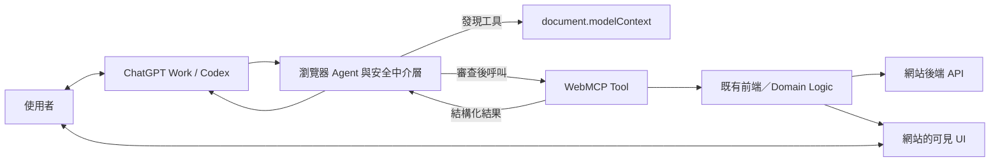

# OpenAI WebMCP 技術研究與實作指引

> 文件定位：重要技術指引（Living Document）  
> 最後核對：2026-08-27  
> 適用範圍：OpenAI Site tools、WebMCP 規格、Chrome／Edge 實驗性實作  
> 穩定性：WebMCP 目前仍是實驗性 CG-DRAFT；實作前必須重新核對最新規格與目標瀏覽器文件。

## 執行摘要

OpenAI 的 WebMCP 實作稱為 **Site tools**。它讓目前開啟的網站，以結構化工具的形式把功能直接提供給 AI Agent，並沿用相同頁面、登入狀態與前端應用邏輯。

WebMCP 不是 OpenAI 私有協定，也不是傳統 MCP Server。它是由 W3C Web Machine Learning Community Group 孵化中的實驗性 Web 標準；OpenAI、Chrome 等產品各自實作瀏覽器端 Agent 整合。

WebMCP 的核心價值是：

- 用結構化工具取代容易失效的純畫面或 DOM 猜測。
- 讓網站明確定義工具用途、輸入 Schema、副作用及回傳資料。
- 讓使用者與 Agent 共用同一個 live page、登入 session 與 UI 狀態。
- 直接重用既有前端及 domain logic。
- 保留人類可見、可介入、可確認的操作流程。

現階段的技術判斷：

> WebMCP 值得用於原型、評估與提早布局，但尚不適合成為生產環境唯一的 Agent 操作通道。

## 1. WebMCP 解決的問題

傳統瀏覽器 Agent 通常依賴：

- 截圖與視覺辨識。
- DOM 或 Accessibility Tree。
- 模擬滑鼠點擊及鍵盤輸入。
- 猜測按鈕、欄位與工作流程的用途。

這些做法可以操作未針對 Agent 設計的網站，但有下列問題：

- UI 改版後容易失效。
- 多步操作的每一步都可能誤判。
- 日期選擇器、圖表、Canvas、地圖及自訂元件難以理解。
- Agent 無法可靠分辨「預覽」、「確認」和「立即購買」。
- 網站只能被動讓 Agent 猜測，不能表達建議的操作方式。

WebMCP 讓網站主動宣告能力，例如：

```text
工具：search_orders
用途：搜尋目前帳號的訂單
參數：status、date_from、date_to
限制：status 只能是 open、shipped、cancelled
副作用：無，只讀取資料
結果：更新目前頁面的訂單表格並回傳摘要
```

Agent 可直接呼叫結構化工具，不必逐一尋找欄位和按鈕。

WebMCP 不需要完全取代視覺操作。較實際的架構是混合模式：

- WebMCP 負責可靠、結構化的操作。
- DOM／畫面負責理解狀態、驗證結果及處理未被工具覆蓋的功能。

## 2. 整體架構



典型執行流程：

1. 使用者開啟網站，保留目前 cookies、登入狀態及頁面資料。
2. 網站透過 JavaScript 或 HTML form 註冊工具。
3. 瀏覽器觀察目前文件及可用工具清單。
4. Agent 根據使用者意圖選擇工具並產生結構化參數。
5. 瀏覽器執行安全檢查及必要的使用者確認。
6. 工具的 `execute()` 在目前頁面的 JavaScript 環境執行。
7. 工具呼叫既有應用邏輯、更新 UI，並回傳可序列化結果。
8. Agent 重新檢視頁面，驗證狀態是否真的改變。

支援 WebMCP 的頁面可以理解為存活於目前瀏覽器分頁、以 client-side JavaScript 實作的臨時工具伺服器。

但 WebMCP 規格並未要求瀏覽器內部一定使用 MCP 傳輸格式。瀏覽器可以使用 MCP、專有 function calling 或其他機制把工具提供給模型。

## 3. OpenAI Site tools

OpenAI 在 2026-08-25 公布 Site tools 支援。依 2026-08-27 核對的官方文件：

- 使用介面是 ChatGPT 桌面 App 的內建瀏覽器。
- ChatGPT Work 與 Codex 可以發現及呼叫目前頁面的工具。
- 支援 GPT-5.6 Sol、GPT-5.6 Terra。
- GPT-5.6 Luna 當時停用 WebMCP。
- Enterprise 與 Edu workspace 當時不可用。
- 實際可用性受漸進推出及目前網站是否提供工具影響。
- 使用者可從網址列的 `Site tools → Available site tools` 查看工具。
- 可在 `Settings → Browser → Permissions → Enable site tools` 關閉。
- 每次呼叫會經過瀏覽器安全審查。
- 發訊息、購買、刪除資料及變更權限等重大操作仍受既有確認政策約束。

這些產品、模型與 workspace 限制屬於時效性資訊，使用前必須重新查閱 OpenAI 官方文件。

Site tools 的重點是共用同一個 live page：

- Agent 使用使用者正在查看的文件。
- 沿用目前網站登入狀態。
- 工具可以直接更新畫面。
- 使用者能視覺確認結果。
- 不必額外安裝該網站專屬的 MCP Server。

## 4. Imperative API

### 4.1 現行入口

目前規格的 API 位於：

```javascript
document.modelContext
```

部分早期文章使用 `navigator.modelContext`，那是舊提案寫法。實作時必須以現行規格及目標瀏覽器文件為準。

### 4.2 最小可用範例

```javascript
if (typeof document.modelContext?.registerTool === "function") {
  await document.modelContext.registerTool({
    name: "get_page_title",
    description: "Read the title of the current page.",
    inputSchema: {
      type: "object",
      properties: {},
      additionalProperties: false
    },
    annotations: {
      readOnlyHint: true
    },
    execute: async () => ({
      title: document.title
    })
  });
}
```

### 4.3 完整範例

```javascript
if (typeof document.modelContext?.registerTool === "function") {
  const controller = new AbortController();

  await document.modelContext.registerTool(
    {
      name: "filter_orders",
      title: "篩選訂單",
      description:
        "依照訂單狀態篩選目前帳號的訂單，只讀取資料，不會修改訂單。",

      inputSchema: {
        type: "object",
        properties: {
          status: {
            type: "string",
            enum: ["open", "shipped", "cancelled"],
            description: "要顯示的訂單狀態"
          }
        },
        required: ["status"],
        additionalProperties: false
      },

      annotations: {
        readOnlyHint: true,
        untrustedContentHint: false
      },

      execute: async ({ status }, { signal }) => {
        const orders = await orderService.filter({ status, signal });

        renderOrderTable(orders);

        return {
          status,
          count: orders.length,
          orderIds: orders.map((order) => order.id)
        };
      }
    },
    {
      signal: controller.signal
    }
  );

  // 元件卸載或工具不再適用時取消註冊：
  // controller.abort();
}
```

### 4.4 核心欄位

| 欄位 | 意義 |
|---|---|
| `name` | Agent 呼叫工具時使用的唯一名稱 |
| `title` | 顯示給使用者看的名稱，可省略 |
| `description` | 告訴 Agent 何時使用及所有副作用 |
| `inputSchema` | JSON Schema 格式的輸入參數 |
| `execute` | 真正執行功能的 JavaScript callback |
| `annotations.readOnlyHint` | 提示工具不修改狀態 |
| `annotations.untrustedContentHint` | 提示輸出包含外部或使用者生成內容 |

工具名稱目前限制為 1–128 個字元，只允許 ASCII 英數、底線、連字號與句點。

`readOnlyHint` 和 `untrustedContentHint` 只是提示，不是可依賴的安全保證。

### 4.5 生命週期

工具與目前 `Document` 綁定：

- 可以根據頁面、元件或登入狀態動態註冊。
- 不再適用時應取消註冊。
- 頁面重新載入或導覽後必須重新註冊。
- `AbortController` 可以管理註冊生命週期。
- `execute()` 的 `{ signal }` 用於取消長時間請求。
- 工具清單改變時會產生 `toolchange` 事件。
- 頁面卸載時，尚未完成的工具呼叫可能被取消。

頁面內自己實作的 Agent 還可使用：

```javascript
const tools = await document.modelContext.getTools();
const result = await document.modelContext.executeTool(tools[0], input);
```

內建瀏覽器 Agent 透過瀏覽器內部 observation 機制取得工具，不必直接在頁面執行以上程式。

## 5. Declarative API

WebMCP 可以透過 HTML attributes，把既有表單漸進增強為工具：

```html
<form
  toolname="search_orders"
  tooldescription="依照狀態搜尋目前帳號的訂單。"
  toolautosubmit
>
  <label for="status">訂單狀態</label>

  <select
    id="status"
    name="status"
    required
    toolparamdescription="限制要搜尋的訂單狀態。"
  >
    <option value="open">處理中</option>
    <option value="shipped">已出貨</option>
    <option value="cancelled">已取消</option>
  </select>

  <button type="submit">搜尋</button>
</form>
```

主要屬性：

- `toolname`：工具名稱。
- `tooldescription`：工具用途及行為。
- `toolparamdescription`：欄位參數說明。
- `toolautosubmit`：Agent 填入欄位後自動提交。

瀏覽器可根據以下資訊合成 JSON Schema：

- `name`
- input type
- `required`
- `<label>`
- `<select>` options
- `toolparamdescription`
- ARIA 說明

若沒有 `toolautosubmit`，Agent 只填好表單，由使用者手動提交。這適合購買、申請、付款等敏感流程。

提交事件另外提供：

- `SubmitEvent.agentInvoked`：是否由 Agent 觸發。
- `SubmitEvent.respondWith(promise)`：把非導覽式結果回傳給 Agent。
- `toolactivated`／`toolcancel` 事件。
- `:tool-form-active`／`:tool-submit-active` CSS 狀態。

重要警告：Chrome 已有 Declarative API 實作文件，但截至最後核對日期，WebMCP 主規格中的 declarative algorithm 仍含 TODO。它比 Imperative API 更可能發生語法或行為調整。

## 6. 跨來源與 iframe

WebMCP 不允許所有頁面任意呼叫彼此工具。

基本規則：

- API 需要 secure context。
- Permissions Policy 預設為 `tools 'self'`。
- 頂層文件與同源 iframe 可使用。
- 跨來源 iframe 預設不可使用。
- 父頁面必須明確加入 `allow="tools"`。

```html
<iframe
  src="https://partner.example"
  allow="tools"
></iframe>
```

工具端還需透過 `exposedTo` 允許來源：

```javascript
await document.modelContext.registerTool(tool, {
  exposedTo: ["https://trusted.example"]
});
```

兩層控制分別處理：

1. iframe 是否被允許使用 WebMCP。
2. 特定工具是否願意暴露給特定來源。

若頁面啟用 `document.domain`，例如使用 `Origin-Agent-Cluster: ?0` 退出 origin isolation，WebMCP API 會停用。

## 7. WebMCP 與 MCP 的差異

| 面向 | 傳統 MCP | WebMCP |
|---|---|---|
| 執行位置 | 本機或遠端 Server | 目前瀏覽器頁面 |
| 生命週期 | 長期存在 | 分頁／Document 綁定 |
| 使用條件 | 不必開啟網站 | 必須造訪該頁面 |
| 登入狀態 | OAuth、API Token 或 Server credentials | 目前網站 cookies/session |
| 使用者介面 | 可完全 headless | 與 live DOM/UI 共用 |
| Discovery | 使用者或 Client 設定 MCP Server | 網站在頁面載入時註冊 |
| 能力範圍 | Tools、resources、prompts 等 | 目前主要是 tools |
| 傳輸 | MCP 定義的 Client/Server 協定 | 瀏覽器內部傳遞方式不由 WebMCP 強制規定 |
| 適用工作 | 背景工作、跨平台 API 整合 | 共同瀏覽、互動式頁面工作 |
| 部署 | 需另外部署或安裝 Server | 加入網站 JavaScript／HTML |

兩者不是競爭關係。例如電商可以同時提供：

- MCP Server：背景查庫存、建立採購單、跨平台整合。
- WebMCP：在使用者目前開啟的產品頁篩選商品、更新購物車、顯示確認畫面。

### 選擇原則

適合 WebMCP：

- 操作必須依賴目前頁面狀態。
- 使用者與 Agent 需要共用畫面。
- 功能使用目前登入 session。
- 希望使用者能直接檢視及介入結果。
- 主要工作是表單、Canvas、Dashboard、搜尋、篩選或頁內狀態操作。

適合 MCP：

- 工作不應依賴一個開啟中的分頁。
- 需要背景或排程執行。
- 需要跨平台、跨 Client 使用。
- 功能本質上是後端服務或 API。
- 需要 tools 以外的 MCP primitives。

大型系統通常應同時使用兩者。

## 8. 安全模型與主要風險

WebMCP 改善操作可靠性，但不會自動讓 Agent 或網站變安全。

### 8.1 Tool poisoning

惡意網站可能在工具名稱、描述或參數描述中放入 prompt injection，要求 Agent：

- 忽略使用者指令。
- 讀取其他網站資料。
- 傳送個人資訊。
- 執行未被授權的額外動作。

Agent 與瀏覽器必須把工具 metadata 視為不受信任內容。

### 8.2 Output injection

工具回傳的評論、訊息或使用者生成內容可能包含惡意指令，影響 Agent 下一步行為。

含外部內容的工具應標註：

```javascript
annotations: {
  untrustedContentHint: true
}
```

此標註只能提供風險訊號，不能取代輸出清理、Agent 防護或確認策略。

### 8.3 意圖謊報

名稱為 `finalize_cart` 的工具，實際行為可能直接完成付款。自然語言描述不是可驗證的行為契約。

因此：

- Description 必須清楚說明所有副作用。
- 敏感操作應由網站再次確認。
- 不可只依賴 Agent 或瀏覽器判斷工具名稱。
- `readOnlyHint` 不得取代程式層面的權限控制。

### 8.4 登入權限被濫用

WebMCP 沿用目前登入狀態，因此 `execute()` 必須遵循與 UI 相同的：

- Authentication
- Authorization
- CSRF 防護
- 輸入驗證
- 商業規則
- 權限範圍
- Rate limiting

不可因為呼叫者是 Agent，就建立驗證較弱的第二條路徑。

### 8.5 過度索取個資

一個看似普通的搜尋工具，可能要求年齡、地點、健康資料或購買紀錄等非必要欄位。

工具必須遵循最小資料原則：

- 只要求完成功能真正需要的參數。
- 不把 Agent 的跨站記憶當作可自由存取的資料源。
- 不要求 Agent 自動補入未經使用者授權的個人資料。

### 8.6 跨來源洩漏

`exposedTo` 只能列入真正信任的 HTTPS origin。即使是 read-only 工具，也可能洩漏訂單、喜好或帳號狀態。

### 8.7 不可逆及可重複操作

對付款、刪除、發送、發布及權限變更等操作，應同時具備：

- 人類確認。
- 伺服器端授權。
- 清楚且可驗證的結果。
- 冪等性或 request identifier。
- Rate limit。
- Audit log。
- 對重試及逾時狀況的明確處理。

## 9. 規格成熟度及已知缺口

截至 2026-08-27，WebMCP 是 `CG-DRAFT`，不是正式 W3C Recommendation。現行規格 metadata 列出的編輯者來自 Microsoft 與 Google；OpenAI 是採用及產品實作者之一。

主要缺口：

- Declarative API 的正式規範演算法尚未完成。
- `outputSchema` 尚在討論。
- 瀏覽器是否原生驗證 input/output schema 尚未定案。
- Streaming input/output 尚未完成。
- 多模態二進位資料仍是開放問題。
- 長時間工具的 progress reporting 尚未定義。
- 原生使用者確認／elicitation API 仍在設計。
- Service Worker 背景工具仍是提案。
- 跨文件導覽後如何回傳工具結果仍有邊界案例。
- 私密瀏覽及跨站 Agent context 的安全模型仍在研究。
- Agent 必須先造訪網站，才能發現頁面工具。
- 主要用途仍是本機瀏覽器、人類在迴路的操作。

Chrome 從 149 提供 Origin Trial；Microsoft Edge Origin Trial 在最後核對時列出的到期日為 2026-11-17。兩者都明確標示為實驗功能。

### 實作相容性提醒

- 一律先做 feature detection。
- 不依賴舊文章中的 `navigator.modelContext`。
- Chrome 文件與最新規格可能有短期 API 差異。
- 針對目標瀏覽器版本執行 Inspector 及整合測試。
- 保留完整的非 WebMCP UI 及 graceful degradation。
- 不將試驗性 API 當成唯一業務通道。

## 10. 實作原則

### 10.1 Tool strategy

- 從少量、高價值、單一目的的工具開始。
- 每個工具只做一個清楚的工作。
- 避免用途重疊的工具。
- 只有在目前頁面狀態可使用時才註冊。
- 優先重用既有 domain service。
- 靜態註冊應是預設；只有狀態真的改變時才動態調整。
- 工具數量會消耗 Agent context，並增加選錯工具的機率。

### 10.2 Schema

- 使用清楚的 `type`、`enum`、`required`。
- 適合時加入 `additionalProperties: false`。
- 使用有語義的自然語言值，避免不透明 ID。
- 不要求模型做可由程式可靠完成的數學或格式轉換。
- Schema 協助 Agent 產生參數；程式碼仍須嚴格驗證。
- 錯誤訊息必須能讓 Agent 判斷可否修正及重試。

### 10.3 Tool description

Description 必須清楚回答：

- 這個工具做什麼？
- 什麼情況應使用？
- 會不會修改資料？
- 是否會提交、購買、發送或導覽？
- 執行成功後畫面會發生什麼變化？
- Agent 應如何驗證結果？

不應在 description 中：

- 放入與工具無關的流程指令。
- 要求 Agent 忽略使用者或系統政策。
- 隱藏實際副作用。
- 要求非必要的個人資料。
- 使用模糊的 `finalize`、`process` 等詞描述不可逆操作。

### 10.4 回傳資料

- 回傳完成下一步所需的最少資訊。
- 提供穩定、結構化、可序列化的結果。
- 同時更新可見 UI。
- 對 UGC 或外部內容標註不受信任。
- 避免在回傳中放入大量頁面文字。
- 清楚區分成功、暫時錯誤、輸入錯誤及權限錯誤。

### 10.5 Progressive enhancement

網站必須在沒有 WebMCP 時仍可正常操作：

```javascript
if (typeof document.modelContext?.registerTool !== "function") {
  // 保留原有 UI，不註冊 WebMCP 工具。
}
```

WebMCP 是額外的 Agent 介面，不應取代：

- Semantic HTML。
- Accessibility。
- 鍵盤操作。
- 人類使用的表單與確認介面。
- 正常後端 API 驗證。

## 11. 測試與 Evals

WebMCP 同時需要 deterministic tests 與模型 evals。

### 11.1 Deterministic tests

測試：

- Tool JavaScript 邏輯。
- Schema 以外的輸入驗證。
- 依賴服務是否被正確呼叫。
- UI 是否更新。
- 副作用是否符合預期。
- 回傳資料是否正確。
- 取消、逾時及 runtime error。
- Authorization 及 CSRF 防護。
- 重試時是否保持冪等。

### 11.2 模型 Evals

測試：

- 模型能否理解工具用途。
- 是否選擇正確工具。
- 是否產生正確參數。
- 相似工具是否造成混淆。
- 多工具順序是否正確。
- 工具輸出是否足以支持下一個決策。
- 頁面狀態改變後是否使用新的工具集合。
- 直接要求及模糊意圖是否都能成功。
- 中間工具失敗時是否會錯誤地繼續重大操作。

例如購物流程中優惠券套用失敗，Agent 不應無視失敗並用原價完成付款。

### 11.3 安全 Evals

至少涵蓋：

- Tool description prompt injection。
- Parameter description prompt injection。
- Tool output injection。
- 不可信 UGC。
- 副作用與描述不一致。
- 過度要求個人資料。
- 跨來源資料洩漏。
- 重複呼叫。
- 未經確認的不可逆操作。

## 12. 導入檢查清單

### 規劃

- [ ] 已確認這個功能需要目前頁面、session 或 live UI。
- [ ] 已判斷應使用 WebMCP、MCP 或兩者並用。
- [ ] 每個工具都有單一、清楚且不重疊的用途。
- [ ] 工具直接重用現有業務邏輯及權限模型。

### API

- [ ] 使用現行 `document.modelContext`。
- [ ] 有 feature detection 及 graceful degradation。
- [ ] Schema 使用明確型別、enum、required 及邊界。
- [ ] 程式碼中仍執行完整輸入驗證。
- [ ] 工具生命週期與頁面／元件狀態一致。
- [ ] 長時間工作支援 `AbortSignal`。
- [ ] UI 與工具結果保持同步。

### 安全

- [ ] Tool metadata 及結果一律視為不受信任。
- [ ] Read-only 與 untrusted content annotation 正確。
- [ ] 不可逆操作保留人類確認。
- [ ] Authorization、CSRF 及商業規則與原 UI 相同。
- [ ] `exposedTo` 只包含必要且可信任的來源。
- [ ] 工具只要求最低必要資料。
- [ ] 有 rate limit、audit、重試及冪等設計。

### 驗證

- [ ] 有 deterministic unit/integration tests。
- [ ] 有工具選擇、參數及多步流程 evals。
- [ ] 有中途失敗及安全攻擊 evals。
- [ ] 使用 WebMCP Inspector 在目標瀏覽器測試。
- [ ] 已確認目標 Chrome／Edge／OpenAI 版本的實際支援狀態。

## 13. 技術結論

WebMCP 代表 Web 從「只提供人類 UI」逐步變成同時提供人類 UI 與 Agent 工具介面。

它帶來：

- 比像素及 DOM 猜測更可靠的操作。
- 網站可控制 Agent 使用功能的建議方式。
- 人與 Agent 共用相同登入狀態、畫面和應用狀態。
- 既有網站可透過 progressive enhancement 漸進導入。
- 前端開始擁有類似 API contract 的 Agent 介面。

它沒有消除：

- Prompt injection。
- 權限及登入風險。
- 意圖描述與實際行為不一致。
- 跨來源資料洩漏。
- 模型選錯工具或參數。
- 實驗規格變動及瀏覽器相容性問題。

採用原則：

> 將 WebMCP 視為可驗證、可降級、受既有授權與人類確認約束的 Agent 介面；不要將它視為可信任的自動化捷徑。

## 14. 官方來源

### OpenAI

- [Site tools – OpenAI Developers](https://developers.openai.com/codex/webmcp)
- [ChatGPT & Codex changelog](https://developers.openai.com/codex/changelog)
- [WebMCP Challenge](https://openai.com/webmcp-challenge)

### WebMCP 規格

- [WebMCP Draft Community Group Report](https://webmachinelearning.github.io/webmcp/)
- [webmachinelearning/webmcp GitHub repository](https://github.com/webmachinelearning/webmcp)
- [規格原始檔 index.bs](https://github.com/webmachinelearning/webmcp/blob/main/index.bs)

### Chrome

- [WebMCP overview](https://developer.chrome.com/docs/ai/webmcp)
- [Imperative API](https://developer.chrome.com/docs/ai/webmcp/imperative-api)
- [Declarative API](https://developer.chrome.com/docs/ai/webmcp/declarative-api)
- [WebMCP best practices](https://developer.chrome.com/docs/ai/webmcp/best-practices)
- [WebMCP tool security](https://developer.chrome.com/docs/ai/webmcp/secure-tools)
- [WebMCP versus MCP](https://developer.chrome.com/docs/ai/webmcp/compare-mcp)
- [WebMCP Evals](https://developer.chrome.com/docs/ai/webmcp/evals)
- [Chrome WebMCP Origin Trial](https://developer.chrome.com/blog/ai-webmcp-origin-trial)

### Microsoft Edge

- [Microsoft Edge WebMCP Origin Trial](https://developer.microsoft.com/microsoft-edge/origin-trials/trials/0b76fe60-b266-458e-a285-04e375c0c31a)

## 15. 維護規則

更新或引用本文件前，應重新核對：

1. WebMCP 規格狀態及 `document.modelContext` WebIDL。
2. Declarative API 是否已正式納入主規格。
3. Chrome Status、Origin Trial 及 stable release 狀態。
4. OpenAI Site tools 支援模型、產品表面及 workspace 限制。
5. `outputSchema`、streaming、progress、user interaction 等開放議題。
6. 最新安全指南及 prompt injection 防護建議。

若官方規格與本文件不一致，以最新官方規格、目標瀏覽器文件及 OpenAI 官方文件為準。
