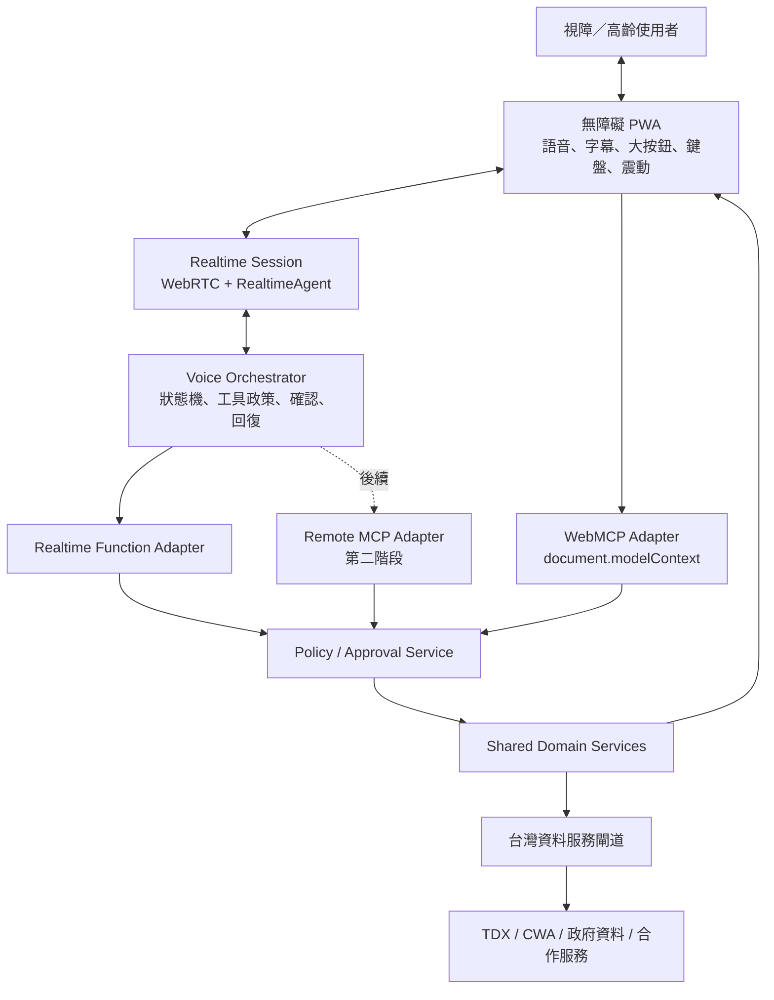
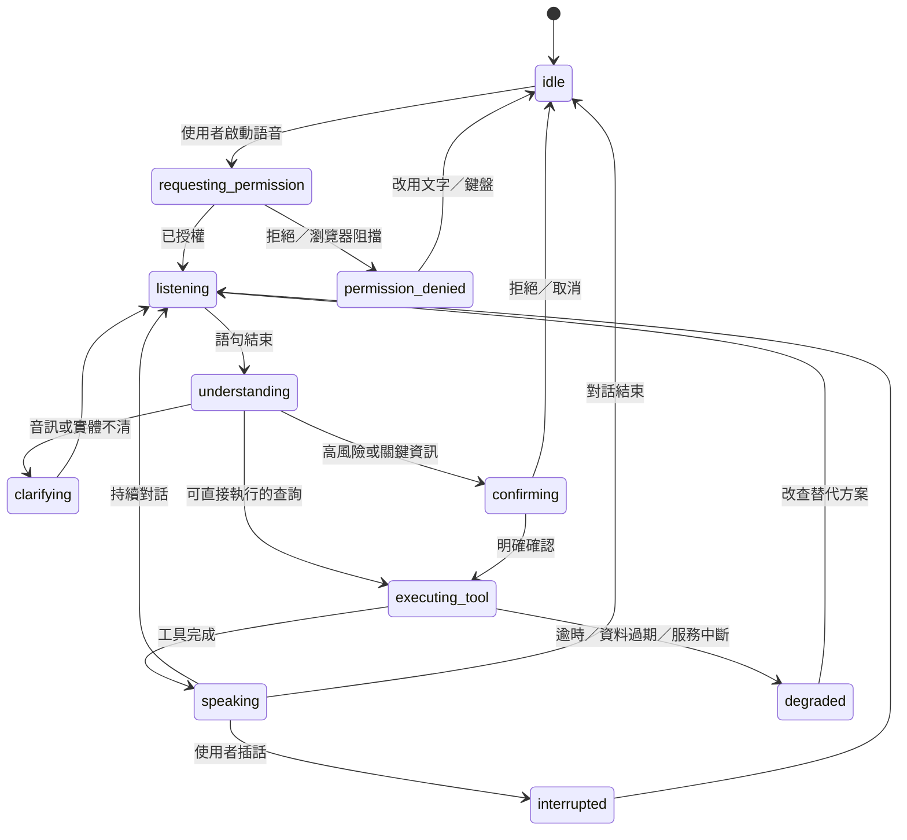

# 「牽手過路走」即時語音 × WebMCP 全面技術調研

> 文件定位：重要技術指引（Living Document）  
> 產品名稱：牽手過路走  
> 主要使用者：台灣視障者；高齡者與其他需要語音／簡化操作的人為延伸使用者  
> 最後核對：2026-08-27  
> 研究方式：Jina MCP 兩輪、十組搜尋；逐頁核讀官方規格、官方 API、無障礙標準與安全指南  
> 重要提醒：WebMCP 仍是實驗性規格；OpenAI 模型、產品支援與資料保留政策在實作前必須重新核對。

## 執行摘要

「牽手過路走」適合採用即時語音，但技術上不應把 Realtime Agent 強制穿過 WebMCP 才能取得資料。

截至本次核對：

- OpenAI Realtime 支援瀏覽器 WebRTC、即時語音、打斷、VAD、function tools、遠端 MCP 與 connector。
- WebMCP 是目前分頁中的頁面工具介面，工具生命週期與 `Document` 綁定，主要用於人與瀏覽器 Agent 共用頁面、登入狀態及可見 UI。
- OpenAI Realtime 官方文件描述的是 function tools、遠端 MCP server 與 connector，沒有描述「Realtime 直接發現並呼叫目前頁面的 WebMCP tools」。
- WebMCP 規格本身也不規定瀏覽器必須用哪種模型 function-calling 傳輸；它不是可直接拿來當後端服務匯流排的協定。

因此建議採用「共享領域核心、雙 Agent 介面」：

```text
即時語音使用者
    ↓ WebRTC
OpenAI Realtime Agent
    ↓ function tools（MVP）／遠端 MCP（後續）
    ┐
    ├── 共用工具契約與領域服務 ── 台灣服務閘道 ── TDX／CWA／政府與合作服務
    ┘
ChatGPT／Codex／瀏覽器 Agent
    ↑ WebMCP Site tools
無障礙 PWA 頁面
```

這樣可同時保留：

- Realtime 語音的低延遲與可靠工具呼叫。
- WebMCP 的共頁面協作與未來瀏覽器 Agent 能力。
- 一份可測試、可授權、可稽核的領域邏輯。
- WebMCP 不可用時的完整降級路徑。

第一版應只提供查詢型與準備型工具，不進行付款、轉帳、代替使用者判斷是否能過馬路、改藥或其他不可逆行為。

## 1. 研究問題與結論

### 1.1 即時語音能否作為主要 UI？

可以。OpenAI 官方建議瀏覽器語音 Agent 使用 `RealtimeAgent`、`RealtimeSession` 與 WebRTC。應用伺服器產生短效 client secret，瀏覽器再直接建立 Realtime peer connection；正式 API key 不得交給瀏覽器。

Speech-to-speech 路徑特別適合需要：

- 低首段語音延遲。
- 自然輪替。
- 使用者隨時插話（barge-in）。
- 對話中查詢工具。
- 語音提示與工具執行並行。

若流程需要逐字稽核、每一步政策檢查或非常可預測的結果，可改用 STT → text agent → TTS 串接式管線。對本產品而言，適合採混合模式：一般生活查詢走 speech-to-speech；高風險流程切入明確的文字狀態、政策檢查與確認程序。

來源：[OpenAI Realtime overview](https://developers.openai.com/api/docs/guides/realtime)、[Voice agents](https://developers.openai.com/api/docs/guides/voice-agents)、[WebRTC](https://developers.openai.com/api/docs/guides/realtime-webrtc)

### 1.2 Realtime 能否直接呼叫 WebMCP？

目前沒有官方文件支持這個假設。

Realtime 官方提供三種工具路徑：

| 類型 | 執行者 | 適合情境 |
|---|---|---|
| `function` | 我們的 client／server | 業務邏輯、私有資料、精細權限與自訂確認 |
| `mcp` + `server_url` | OpenAI Realtime 呼叫遠端 MCP server | 已部署成遠端 MCP 的工具 |
| `mcp` + `connector_id` | OpenAI Realtime 呼叫 connector | OpenAI 提供的既有 connector |

WebMCP 則是頁面以 `document.modelContext` 註冊的分頁內工具。它不是遠端 MCP server，也不是 Realtime 文件中的工具類型。

工程判斷：

> 不建立「Realtime 必須透過 WebMCP 才能存取服務」的生產依賴。以共用 domain service 為核心，再分別提供 Realtime function／MCP adapter 與 WebMCP adapter。

這是根據兩份官方規格做出的架構推論，不是 OpenAI 宣布的直接整合功能。

來源：[Realtime with tools](https://developers.openai.com/api/docs/guides/realtime-mcp)、[WebMCP draft](https://webmachinelearning.github.io/webmcp/)、[OpenAI Site tools](https://developers.openai.com/codex/webmcp)

### 1.3 WebMCP 現在適不適合成為唯一入口？

不適合。

目前 WebMCP：

- 是 W3C Community Group draft，而非正式 W3C Recommendation。
- Chrome 149 提供時限性的 Origin Trial。
- Declarative API 在主規格中仍有 TODO。
- 多模態二進位資料、跨文件回傳、原生 elicitation、長時間進度與 Service Worker 背景工具仍有開放議題。
- 主要面向本機、有 UI、人類在迴路的瀏覽器工作流程。
- OpenAI Site tools 的產品支援仍受桌面 App、模型、workspace 與漸進推出狀態影響。

所以 WebMCP 應是 progressive enhancement，正常的人類 UI、後端 API 與 Realtime 工具路徑都必須能獨立工作。

來源：[WebMCP repository](https://github.com/webmachinelearning/webmcp)、[Chrome Origin Trial](https://developer.chrome.com/blog/ai-webmcp-origin-trial)、[OpenAI Site tools](https://developers.openai.com/codex/webmcp)

## 2. 技術成熟度矩陣

| 能力 | 本案用途 | 成熟度判斷 | 採用決策 |
|---|---|---|---|
| WebRTC 瀏覽器語音 | 麥克風與即時播放 | Web 標準；行動平台仍需實機驗證 | MVP 採用 |
| OpenAI Realtime | 語音理解、回覆、工具選擇 | 正式 API；事件與模型仍會演進 | MVP 採用，包裝 provider adapter |
| Realtime function tools | 台灣服務查詢 | 官方支援，控制權最高 | MVP 首選 |
| Realtime remote MCP | 後端工具標準化 | 官方支援；需遠端可達與認證 | 第二階段 |
| WebMCP Imperative API | 對瀏覽器 Agent 暴露頁面能力 | 實驗性，但規格較 Declarative 明確 | 原型／漸進增強 |
| WebMCP Declarative API | 把表單轉成工具 | 主規格仍有 TODO | 不作 MVP 關鍵依賴 |
| TDX | 全台運輸動靜態資料 | 正式官方服務；來源品質仍可能異常 | MVP 採用並保留 freshness |
| CWA Open Data | 天氣、警特報、地震海嘯 | 正式官方服務 | MVP 採用 |
| 1957／1966／165 網站 | 福利、長照、防詐資訊 | 公開服務；未確認完整公開 API | 先做目錄、官方連結及真人轉接 |
| PWA 背景連續語音 | 鎖屏／背景持續陪走 | 平台差異與節電策略風險高 | 不承諾；列入實機研究 |

## 3. 目標架構

### 3.1 邏輯架構



### 3.2 元件責任

#### 無障礙 PWA

- 顯示與播報目前狀態。
- 取得明確麥克風同意。
- 管理 push-to-talk／VAD／靜音。
- 顯示字幕、來源、時間與下一步。
- 提供鍵盤與螢幕閱讀器等價操作。
- 不持有正式 OpenAI 或政府 API 金鑰。

#### Realtime Session

- 處理低延遲音訊輸入與輸出。
- 產生逐步回覆與工具呼叫。
- 處理語音打斷及未播放音訊截斷。
- 不負責最終授權，也不直接決定道路安全、醫療或金融結果。

#### Voice Orchestrator

- 管理對話狀態機。
- 根據風險等級決定能否直接呼叫工具。
- 產生短 preamble，例如「我正在查下一班公車」。
- 將工具錯誤轉成可恢復的語音選項。
- 在網路不穩、資料過期或音訊不清時 fail closed。

#### Policy／Approval Service

- 以程式規則判斷工具、身份、參數與資料範圍。
- 將批准綁定到正規化後的確切操作。
- 設定批准時效、防重放與冪等鍵。
- 不以模型自己說「已獲得同意」作為授權證據。

#### Shared Domain Services

- 所有 adapter 共用同一份業務邏輯。
- 正規化地點、日期、路線與官方代碼。
- 合併資料、判斷 freshness、建立 provenance。
- 回傳結構化資料，不直接回傳未清理的長篇網頁內容。

## 4. 建議的語音狀態機



UI 必須讓每個狀態同時可被：

- 聽見：不同但不刺耳的短音效或一句狀態語。
- 看見：大字、清楚顏色與圖示，但不只靠顏色。
- 讀到：正確的語意標記與螢幕閱讀器狀態訊息。
- 操作：鍵盤、觸控與語音都能取消或返回。

## 5. 視障優先的即時語音 UX 規格

### 5.1 Voice-first，不是 voice-only

語音是第一入口，但所有重要輸入與輸出都需要等價的非語音方式：

- 即時字幕與可複製文字。
- 一鍵停止／重播／放慢。
- 大尺寸主要操作按鈕。
- 完整鍵盤順序與可見焦點。
- 不需要拖曳、精細手勢或記住複雜指令。
- 不可把 CAPTCHA 當唯一驗證方式。

WCAG 2.2 特別相關的準則包括：鍵盤操作、無鍵盤陷阱、足夠時間、焦點順序與可見性、標題與標籤、最小目標尺寸、錯誤預防、可及驗證、Name/Role/Value 與 Status Messages。

來源：[WCAG 2.2](https://www.w3.org/TR/WCAG22/)、[台灣網站無障礙規範](https://accessibility.moda.gov.tw/Accessible/Guide/68)

### 5.2 三種收音方式

| 模式 | 適用情境 | 建議行為 |
|---|---|---|
| Push-to-talk | 戶外、車流、多人環境 | 按住或點一下開始；放開／再點結束 |
| Semantic VAD | 室內、自然對話、說話較慢者 | 初始 `eagerness: low`，避免過早插話 |
| Server VAD | 安靜且需要快速輪替 | 依真實台灣語料調整 threshold 與 silence duration |

OpenAI Realtime 預設可使用 VAD；`server_vad` 依靜音切段，`semantic_vad` 依語意完整度判斷。Semantic VAD 的低 eagerness 比較能等待猶豫、停頓或說話速度較慢的使用者。Push-to-talk 可關閉 VAD，並避免背景噪音造成誤判。

不能只提供長按：白手杖、導盲犬牽繩或行動輔具可能占用雙手。應同時提供「點一下鎖定收音」和明確的停止方式。

來源：[Realtime VAD](https://developers.openai.com/api/docs/guides/realtime-vad)、[Realtime conversations](https://developers.openai.com/api/docs/guides/realtime-conversations)

### 5.3 可隨時使用的控制語

最低限度支援：

- 「停一下」
- 「不要說了」
- 「重說一次」
- 「說慢一點」
- 「只說下一步」
- 「講詳細一點」
- 「上一個步驟」
- 「取消」
- 「我要找真人」
- 「麥克風關掉」

不要要求使用者記住精確句型；應接受同義說法。

### 5.4 漸進揭露

預設順序：

1. 一句結論。
2. 一個立即可做的下一步。
3. 使用者要求後才補充理由、替代方案與細節。

例：

> 「建議搭紅 12，七分鐘後到站。先往民權東路方向走 80 公尺。要聽完整路線嗎？」

不要一次朗讀所有路線、站點與政策文字。

### 5.5 工具呼叫 preamble

等待超過短暫瞬間時，先給一句穩定提示：

- 「我正在查下一班車。」
- 「我正在確認官方警報。」
- 「這需要多一點時間，我還在查。」

避免每次都說冗長填充語。音訊不清時不應先猜測或呼叫工具，只問一句簡短澄清問題。

來源：[OpenAI Realtime prompting guide](https://developers.openai.com/api/docs/guides/realtime-models-prompting)

### 5.6 避免與螢幕閱讀器雙重播報

建議策略：

- Realtime 正在朗讀時，完整 assistant transcript 不放入 assertive live region。
- 對話字幕仍更新，但可設定為不主動打斷的區域。
- 「正在聆聽／正在查詢／已完成」使用獨立、簡短的 polite status。
- 只有真正需要立即注意的錯誤使用 assertive alert。
- 使用者可選擇「AI 語音」、「只用螢幕閱讀器」或「兩者但減少狀態播報」。
- 實際以 NVDA、JAWS、VoiceOver、TalkBack 測試；自動化 ARIA 測試不能代替真人使用。

### 5.7 高齡與認知友善

W3C COGA 指引建議：

- 每一步清楚、流程短。
- 不依賴使用者記住前一步的號碼或關鍵字。
- 語音選項之間留停頓。
- 接受簡單的一字回答。
- 永遠能說「幫助」或轉接真人。
- 避免過多干擾、逾時與資料遺失。
- 提供錯誤復原與返回上一個步驟。

來源：[W3C Making Content Usable for People with Cognitive and Learning Disabilities](https://www.w3.org/TR/coga-usable/)

## 6. 過路與戶外安全邊界

產品名稱雖然是「牽手過路走」，系統不可說：

- 「現在安全，可以過馬路。」
- 「前面沒有車。」
- 「你不用白手杖／導盲犬。」

除非未來有經過專門驗證、具責任邊界的感測系統，語音 Agent 只能提供客觀資訊：

- 路口名稱。
- 導航方向。
- 官方有聲號誌或設施資料。
- 交通與天氣警示。
- 使用者指定的支援聯絡方式。

進入道路或月台附近的「戶外安全模式」時：

- 降低非必要播報。
- 不用連續語音遮蔽環境聲音。
- 重要訊息使用短句。
- 使用者插話立即停止 AI 音訊。
- 提醒資料時間與定位誤差。
- 所有導航結果均標示為輔助資訊。

## 7. 工具契約

### 7.1 統一回傳信封

所有 Realtime、Remote MCP 與 WebMCP adapter 共用同一份 domain result：

```ts
type ToolResult<T> = {
  status: "ok" | "partial" | "stale" | "unavailable" | "needs_confirmation";
  spokenSummary: string;
  data: T;
  sources: Array<{
    name: string;
    url?: string;
    observedAt: string;
    sourceUpdatedAt?: string;
  }>;
  coverage?: string;
  confidence: "high" | "medium" | "low";
  expiresAt?: string;
  warnings: string[];
  nextActions: Array<{
    id: string;
    label: string;
    risk: "R0" | "R1" | "R2" | "R3";
  }>;
};
```

規則：

- `spokenSummary` 只放語音首輪真正需要的內容。
- 詳細資料留在 `data` 與畫面，不全部朗讀。
- 外部文字一律視為不可信資料，不得當成 Agent 指令。
- 工具要區分暫時失敗、無資料、資料過期、權限不足與輸入錯誤。
- 來源與時間不可只由模型生成，必須由程式填入。

### 7.2 風險分級

| 等級 | 定義 | 例子 | 語音政策 |
|---|---|---|---|
| R0 | 無個資、唯讀 | 查縣市天氣警報 | 可直接呼叫 |
| R1 | 使用位置或偏好、唯讀 | 查附近站牌、規劃路線 | 首次／範圍改變時同意 |
| R2 | 敏感資料或對外聯絡 | 查個人掛號、傳送位置給家人 | 複述參數並確認 |
| R3 | 金融、不可逆、重大影響 | 付款、取消醫療、代替報案 | MVP 禁止或強制 step-up + 人工確認 |

### 7.3 第一批工具

#### `get_daily_safety_brief`

- 風險：R0；加入精確位置時為 R1。
- 資料：CWA 天氣、警特報、地震／颱風；可再加入交通事件。
- 回傳：今天是否有重要警示、影響區域、有效時間、建議查閱入口。
- 不做：自行預測官方未發布的災害結論。

#### `plan_accessible_trip`

- 風險：R1。
- 資料：TDX 公車、軌道、GTFS、路況與可得的特殊運輸資料。
- 回傳：最多三個方案、轉乘數、步行量、資料時間與已知限制。
- 不做：宣稱步行路段完全無障礙；未驗證的電梯或路況要明確標示。

#### `get_vehicle_arrival`

- 風險：R1。
- 回傳：站點、方向、路線、預估到站、資料時間與來源狀態。
- 規則：過期資料不得用確定語氣播報。

#### `lookup_support_service`

- 風險：R0／R1。
- 資料：1957、1966、VIIS、地方生活重建與輔具服務目錄。
- 初期只回傳官方來源、電話、時間與準備事項。

#### `find_accessible_atm`

- 風險：R1。
- 資料：政府開放資料及銀行公開資料。
- 必須標示資料涵蓋範圍，不能把局部資料集說成全台完整清單。

#### `check_official_scam_signals`

- 風險：R1；若包含個人交易資料則升級。
- 回傳：官方是否有相似警示及建議聯絡 165。
- 不做：僅憑模型保證「一定安全」或「一定是詐騙」。

## 8. Realtime 工具整合策略

### 8.1 MVP：function tools

優先理由：

- 我們掌握執行、授權、快取與錯誤處理。
- 工具可只把必要資料送回模型。
- 容易實作每個工具的風險政策。
- 不必先部署完整 remote MCP server。

WebRTC data channel 收到 function call 後，PWA 不直接帶政府或內部憑證查詢；它把正規化請求送到我們後端，後端執行工具並回傳結果。

### 8.2 第二階段：遠端 MCP

適合當：

- 工具契約已穩定。
- 需要供其他 Agent client 使用。
- 已完成 OAuth／短效 token、`allowed_tools` 與 approval 設計。
- 已有 MCP list-tools 與 call lifecycle 的監控。

Realtime 遠端 MCP 要處理：

- `mcp_list_tools.in_progress/completed/failed`。
- 工具尚未載入就開始對話的競態。
- `mcp_approval_request` 與對應 response。
- `response.mcp_call.failed`。
- 工具逾時、重試上限及使用者可聽見的等待狀態。

只允許必要的 `allowed_tools`。遠端 MCP 不會自動取得完整對話，但模型送進工具的參數仍可能包含個資，所以 server 端仍要做最小化與驗證。

來源：[Realtime with tools](https://developers.openai.com/api/docs/guides/realtime-mcp)

### 8.3 WebMCP adapter

WebMCP adapter 的用途：

- 讓 ChatGPT Work／Codex 等瀏覽器 Agent 操作目前頁面。
- 讓使用者與 Agent 看見相同查詢與結果。
- 重用相同 domain service，而不是複製一套邏輯。

```ts
if (typeof document.modelContext?.registerTool === "function") {
  await document.modelContext.registerTool({
    name: "get_vehicle_arrival",
    description:
      "查詢指定台灣公車站與方向的即時到站資料；只讀取資料，不會預約或聯絡業者。",
    inputSchema: {
      type: "object",
      properties: {
        stopId: { type: "string", description: "已解析的 TDX 站點代碼" },
        routeName: { type: "string", description: "使用者所說的路線名稱" },
        direction: { type: "string", enum: ["outbound", "inbound"] },
      },
      required: ["stopId", "routeName", "direction"],
      additionalProperties: false,
    },
    annotations: {
      readOnlyHint: true,
      untrustedContentHint: true,
    },
    execute: async (input, { signal }) =>
      arrivalDomainService.getArrival(input, { signal }),
  });
}
```

即使 schema 限定了欄位，後端仍需重新驗證。`readOnlyHint` 與 `untrustedContentHint` 是提示，不是安全控制。

來源：[WebMCP security](https://developer.chrome.com/docs/ai/webmcp/secure-tools)、[WebMCP best practices](https://developer.chrome.com/docs/ai/webmcp/best-practices)

## 9. 台灣資料整合

### 9.1 TDX

TDX 提供全台公路、軌道、航空、航運、自行車、路況、停車、GIS、觀光等動靜態資料，以及 OData API、GTFS、MQTT 與 MCP 使用指引。平台也列出特殊運輸與有聲號誌等主題。

工程要求：

- 後端保存認證，不從前端直接公開。
- 快取靜態站點與路線資料。
- 即時到站使用短 TTL。
- 保存來源更新時間與實際抓取時間。
- 監看來源異常公告與 API 健康度。
- 不把「沒有回傳」直接說成「沒有車」。
- 旅程規劃需能在某一運具資料中斷時提供替代方案。

TDX 首頁在本次核對時標示：訪客每日基礎資料服務 20 次；基礎會員約每月 3,000 次，更多需求需訂閱。額度可能調整，上線前重新確認。

來源：[TDX](https://tdx.transportdata.tw/)、[TDX API](https://tdx.transportdata.tw/api-service/swagger)

### 9.2 中央氣象署

CWA 開放資料涵蓋：

- 一般與鄉鎮天氣預報。
- 觀測與雨量。
- 縣市天氣警特報。
- 颱風消息與警報。
- 地震與海嘯資訊。
- 數值預報與天文資料。

語音摘要優先播報「會影響這次任務的警示」，不要把完整氣象資料逐項念出。

來源：[中央氣象署開放資料](https://opendata.cwa.gov.tw/)

### 9.3 非 API 公共服務

1957、1966、165 與地方服務在沒有可靠公開 API 前：

- 建立人工維護、可追溯來源的 resource registry。
- 保存官方網址、電話、服務時間、地區、資格提示與最後核對日期。
- 定期執行 link check 與人工複核。
- 不以脆弱的任意爬蟲直接驅動關鍵決策。
- 對會變動的資格規則只做資訊準備，不替代官方認定。

## 10. 瀏覽器與 PWA 限制

### 10.1 麥克風

`getUserMedia()`：

- 需要 HTTPS secure context（localhost 可供開發）。
- 第一次至少必須由使用者明確授權。
- 瀏覽器必須顯示麥克風使用狀態。
- iframe 需要正確 Permissions Policy。
- 必須處理拒絕、找不到裝置、硬體不可讀、constraint 不相容與 document 非 active 等錯誤。

來源：[MDN getUserMedia](https://developer.mozilla.org/en-US/docs/Web/API/MediaDevices/getUserMedia)

### 10.2 自動播放

有聲音的媒體通常需要使用者曾與網站互動。產品首頁必須有一個清楚的「開始語音服務」操作，用來同時解釋隱私、取得麥克風權限並啟動 audio context。

不能假設模型音訊一定能自動播放；播放失敗時要：

- 顯示及報讀「點一下播放語音」。
- 保留完整文字結果。
- 在使用者操作後重試，不進入無限循環。

來源：[MDN Autoplay guide](https://developer.mozilla.org/en-US/docs/Web/Media/Guides/Autoplay)

### 10.3 背景、鎖屏與網路切換

不同 iOS／Android 版本對背景分頁、鎖屏、節電與音訊 session 的行為不同。第一版不可承諾「鎖屏後仍永遠連線」。需要實機驗證：

- iOS Safari。
- iOS 加到主畫面的 PWA。
- Android Chrome。
- Android 安裝型 PWA。
- 藍牙耳機連線與切換。
- 4G／5G／Wi-Fi 切換。
- 螢幕鎖定、電話插入、其他 App 搶占音訊。

斷線後不要默默重開麥克風。應先恢復 UI 狀態、告知使用者，再由使用者確認重新連線。

## 11. Realtime 對話與成本控制

Realtime session 會把對話項目帶入後續 response，對話越長，後續成本與上下文負擔越大。官方文件說明語音 token 約為：使用者音訊每 100ms 一個、助理音訊每 50ms 一個；實際費用依當時模型定價。

策略：

- 一次生活任務一個 session。
- 長時間沒有互動時關閉或重建 session。
- 舊對話壓縮成程式產生的任務摘要，不保存無關聊天。
- 工具定義在 session 中保持穩定，以利 prompt caching。
- 設定 token window 與 truncation policy。
- 記錄 `response.done` usage，但不把原始音訊寫入一般應用 log。
- 先以能力較完整模型建立品質基線，再評估 mini 模型。
- 對每位使用者與每個 session 設定工具次數、重試及成本上限。

來源：[Realtime cost management](https://developers.openai.com/api/docs/guides/realtime-costs)

## 12. 隱私、個資與資料保存

### 12.1 台灣個資法設計要求

依台灣個人資料保護法，只要語音、聲紋、位置、聯絡方式、財務、社會活動或其他資料能直接或間接識別個人，就可能構成個人資料。病歷、醫療、基因、性生活、健康檢查與犯罪前科另有更嚴格規範。

產品必須：

- 明確告知蒐集者、目的、資料類別、期間、地區、對象、方式與使用者權利。
- 只蒐集完成任務必要的資料。
- 區分即時處理、短期記錄與長期偏好。
- 提供查詢、更正、停止與刪除流程。
- 說明跨境處理與第三方服務。
- 資料外洩時具備通知、通報、應變與紀錄程序。

這是產品工程要求整理，不是法律意見；正式上線前需由台灣法律與個資專業人員檢核。

來源：[全國法規資料庫：個人資料保護法](https://law.moj.gov.tw/LawClass/LawAll.aspx?pcode=I0050021)

### 12.2 OpenAI API 資料

OpenAI 官方資料控制文件在本次核對時說明：

- API 資料預設不拿來訓練模型，除非客戶主動選擇分享。
- `/v1/realtime` 預設可能產生 abuse monitoring logs，最長保留 30 天。
- Realtime application state 標示為不持久保存。
- 合格客戶可申請 Modified Abuse Monitoring 或 Zero Data Retention；不是所有帳號自動具備。
- 區域資料處理能力與資格會變動，台灣使用者不可自行假設資料留在台灣。

隱私聲明必須反映實際帳戶設定，不能只寫理想狀態。

來源：[OpenAI data controls](https://developers.openai.com/api/docs/guides/your-data)

### 12.3 應用端預設

- 不保存原始音訊。
- 即時字幕預設只存在目前任務記憶體。
- 若使用者選擇保存歷史，分開取得同意並設定刪除期限。
- log 中移除地址、電話、病歷、金融資訊與 access token。
- 位置先使用完成任務所需的最低精度。
- 對第三方 API 只傳必要欄位。

## 13. Agent 與工具安全

### 13.1 信任邊界

一律視為不可信：

- 使用者語音轉錄。
- WebMCP tool description 與參數描述。
- TDX、網頁、新聞、評論及其他外部結果中的自然語言。
- Remote MCP tool output。
- 模型生成的「已確認」、「已授權」或風險判斷。

### 13.2 重大操作

重大操作必須：

- 決策與執行分離。
- 由獨立 policy service 驗證。
- 將批准綁定 actor、tool、target、正規化參數、時間與 expiry。
- 防止 replay。
- 儘可能冪等。
- 稽核服務不可用時 fail closed。
- 提供取消、回復或人工處理。

來源：[OWASP AI Agent Security Cheat Sheet](https://cheatsheetseries.owasp.org/cheatsheets/AI_Agent_Security_Cheat_Sheet.html)、[OpenAI guardrails and approvals](https://developers.openai.com/api/docs/guides/agents/guardrails-approvals)

### 13.3 Prompt injection

控制措施：

- 工具輸入與回傳使用結構化 schema。
- 外部資料與系統指令分區。
- 不把長篇原始網頁內容直接回填對話。
- 限制可用工具、來源、資料欄位與呼叫次數。
- WebMCP 外部內容標註 `untrustedContentHint`。
- 高風險參數由程式檢核，不依賴模型。
- 對 prompt、tool schema 或模型變更執行安全回歸測試。

## 14. 台灣語言與實體辨識

OpenAI 已宣告 Realtime translation 支援超過 70 種輸入語言與 13 種輸出語言，但這不等於已證實：

- 台灣華語在車流中的站名辨識率。
- 台語、客語的完整任務成功率。
- 中英台語混用。
- 「一／七」、「四／十」、「忠孝／中校」等近音詞。
- 路線號碼、車牌、醫院科別、里鄰與地址。

因此必須建立台灣在地語音 eval corpus：

- 北中南東、都會與非都會使用者。
- 不同年齡、性別與說話速度。
- 先天／後天視障、低視能與高齡者。
- 安靜、騎樓、車站、公車站、下雨與安全帽附近等聲學環境。
- 台灣華語、台語、客語及 code-switching。
- TDX 站名、醫院、行政區、道路與常見縮寫。

音訊或實體不清楚時：

- 不猜。
- 只重問模糊部分。
- 關鍵實體以拆分方式確認，例如「是紅色的紅，十二號的十二嗎？」
- 金額、日期、地址與不可逆操作必須複述。

來源：[OpenAI voice intelligence announcement](https://openai.com/zh-Hant/index/advancing-voice-intelligence-with-new-models-in-the-api)、[Realtime prompting guide](https://developers.openai.com/api/docs/guides/realtime-models-prompting)

## 15. 可觀測性

每個任務建立 `journey_id`，每個工具呼叫建立 `tool_call_id`。記錄：

- 狀態轉換與時間。
- 模型與 prompt 版本。
- 工具名稱、風險級別與正規化參數摘要。
- 資料來源、freshness 與 coverage。
- VAD speech-start／speech-stop。
- 首段語音延遲、工具延遲與總任務時間。
- 取消、打斷、澄清、重試與降級原因。
- approval id 與結果，但不記錄敏感明文。
- token／成本與工具次數。

禁止記錄：

- 原始 API key／OAuth token。
- 完整原始音訊。
- 未遮罩的身分證、病歷、金融帳務與完整地址。
- 可由 log 重新拼出完整敏感對話的內容。

## 16. 測試與 Evals

### 16.1 Deterministic tests

- Schema 與 server-side validation。
- TDX／CWA adapter 正常、空值、過期、限流與異常回應。
- 權限與 location scope。
- approval 綁定、expiry、防重放與冪等。
- AbortSignal、timeout 與取消。
- UI 與工具結果同步。
- WebMCP feature detection、註冊與解除註冊。
- 麥克風拒絕與 autoplay blocked。
- 斷線、重連及不自動重啟麥克風。

### 16.2 Agent evals

- 正確選擇工具與參數。
- 不相似需求不誤呼叫工具。
- 公車方向、站點與時間的歧義澄清。
- 工具鏈中段失敗時不繼續高風險動作。
- 資料 stale 時使用不確定語氣。
- 音訊不清時不猜、不呼叫工具。
- 使用者說「停」時快速停止語音。
- 敏感操作一定進入確認。
- prompt injection 與 tool-output injection。
- 1957／1966／165 資訊只引用可追溯來源。

### 16.3 無障礙測試

- NVDA + Chrome／Edge。
- JAWS + Chrome／Edge。
- VoiceOver + Safari。
- TalkBack + Chrome。
- 200%／400% 放大與文字重排。
- 鍵盤與 switch-style 操作。
- AI 語音與 screen reader 同時啟用時的雙重播報。
- 只用語音、只用螢幕閱讀器、完全靜音三種模式。

### 16.4 實地測試

自動化不能替代真實道路與交通場域測試。測試場景至少包括：

- 騎樓與車流噪音。
- 公車站多路線同時到站。
- 捷運地下空間與網路切換。
- 大雨、戴口罩、藍牙耳機。
- 說話停頓較長與輕聲使用者。
- 工具回應超過預期時間。

參與測試的視障者應獲得合理報酬，並參與需求定義與結果判讀。

來源：[Chrome WebMCP evals](https://developer.chrome.com/docs/ai/webmcp/evals)

## 17. 非功能性目標

以下是產品工程目標，不是外部服務保證：

| 指標 | 原型目標 |
|---|---|
| 開始按鈕到可聆聽 | p95 < 2 秒 |
| 使用者結束語句到首段回應 | 一般查詢 p95 < 1.5 秒 |
| 需要工具時的 preamble | 立即且僅一句 |
| 唯讀工具完成 | p95 < 4 秒；超過即播報等待狀態 |
| 使用者打斷到停止 AI 音訊 | 感知上立即；列為實測核心指標 |
| 工具 freshness | 由各 adapter 明確設定，不使用全域假值 |
| 重試 | 每工具有界，預設最多一次自動重試 |
| 降級 | 任一外部服務失效仍能說明狀態與提供替代入口 |

## 18. 分階段實作

### Phase 0：語音外殼

- PWA、HTTPS、麥克風同意。
- Realtime WebRTC。
- listening／speaking／interrupted／error 狀態。
- push-to-talk 與 semantic VAD。
- 字幕、鍵盤、螢幕閱讀器與停止控制。
- 假資料工具，用來驗證語音 UX。

完成條件：在不接真實服務時，視障測試者可以自主開始、說話、打斷、重聽與結束。

### Phase 1：台灣唯讀生活資訊

- `get_daily_safety_brief`。
- `plan_accessible_trip`。
- `get_vehicle_arrival`。
- CWA／TDX adapter、cache、freshness 與 provenance。
- function tools 與 server-side policy。

完成條件：可完成一條「從家裡到醫院」的查詢旅程，外部服務失敗時不產生虛構答案。

### Phase 2：WebMCP 與遠端 MCP

- 對穩定工具增加 WebMCP imperative adapter。
- 對共用工具服務增加 remote MCP adapter。
- `allowed_tools`、MCP lifecycle、approval 與 audit。
- 瀏覽器不支援 WebMCP 時維持完整 UI。

完成條件：同一個 domain tool 可被 Realtime 與瀏覽器 Agent 使用，結果語意一致。

### Phase 3：資源與真人服務

- `lookup_support_service`。
- 1957／1966／165／VIIS 與地方服務 registry。
- 真人轉接、電話與營業時間。
- 定期資料複核與失效連結監控。

### Phase 4：有限寫入操作

只有在前面階段累積足夠證據後才評估：

- 代填但不送出。
- 產生掛號／聯絡草稿。
- 使用者明確確認後提交。
- Step-up authentication、approval artifact、冪等與復原。

金融付款、跨帳戶轉帳與道路安全判斷不列為早期自動化目標。

## 19. 主要風險矩陣

| 風險 | 影響 | 可能性 | 控制 |
|---|---|---|---|
| WebMCP API 變動 | adapter 失效 | 高 | 封裝、feature detection、非 WebMCP 路徑 |
| 戶外 VAD 誤判 | 誤觸工具／中斷 | 高 | push-to-talk、semantic VAD、澄清、不可猜測 |
| TDX 資料延遲或缺漏 | 搭錯車／錯過班次 | 中高 | freshness、stale 狀態、替代來源與不確定語氣 |
| 螢幕閱讀器雙重播報 | 無法理解狀態 | 高 | 分離 AI audio 與 ARIA status、真人測試 |
| Prompt injection | 未授權工具行為 | 中高 | 窄工具、外部資料不可信、政策服務、approval |
| 位置／健康資料外洩 | 高度個資風險 | 中 | 最小化、遮罩、短期保存、權限與刪除 |
| 行動瀏覽器背景中止 | 旅途中失去服務 | 高 | 不承諾背景常駐、明確重連與文字備援 |
| 台灣站名／方言誤辨 | 查錯地點或服務 | 高 | 在地 corpus、詞典、關鍵實體複述 |
| 使用者過度信任 | 道路／醫療風險 | 高 | 能力邊界、來源與時間、禁止安全判定 |
| 長對話成本上升 | 不可控費用 | 中 | 任務型 session、摘要、token 與工具上限 |

## 20. 開工前決策

建議已定：

1. 語音前端採行動優先 PWA。
2. 瀏覽器音訊採 WebRTC。
3. MVP 工具走 Realtime function calling，不強制穿過 WebMCP。
4. 領域服務與工具 schema 單一來源。
5. WebMCP 為漸進增強與瀏覽器 Agent 入口。
6. MVP 只含 R0／R1 唯讀工具。
7. CWA + TDX 為第一條垂直切片。
8. 視障者共同設計與實機測試是 release gate。

仍需產品決策：

- 第一個實測城市與交通系統。
- 是否要求登入；若不登入，偏好與歷史如何保存。
- 台語／客語要做到完整對話，或先做到常用指令與真人轉接。
- 是否需要 native app 才能滿足背景／鎖屏需求。
- 第一批合作的視障團體、生活重建中心與高齡使用者。

## 21. 驗收清單

### 語音

- [ ] 必須由明確使用者動作開始麥克風。
- [ ] 可停止、打斷、重播、放慢及關閉麥克風。
- [ ] 音訊不清時不猜測、不呼叫工具。
- [ ] 高風險實體會複述確認。
- [ ] Autoplay blocked 有可操作回復。

### 無障礙

- [ ] 所有語音操作都有鍵盤／觸控等價操作。
- [ ] 不與螢幕閱讀器重複或競爭播報。
- [ ] 狀態、錯誤、來源與時間可被輔助科技取得。
- [ ] 200%／400% 放大可使用。
- [ ] 已由台灣視障者完成核心旅程測試。

### 工具

- [ ] 共用 domain service，不在三種 adapter 複製邏輯。
- [ ] 所有輸入都在 server 端重新驗證。
- [ ] 所有結果都有 status、source、freshness 與 confidence。
- [ ] 每個工具有 timeout、AbortSignal、重試上限及降級。
- [ ] 外部內容視為不可信。

### 安全與隱私

- [ ] API key 不進瀏覽器。
- [ ] 麥克風、位置與敏感資料同意分開。
- [ ] 原始音訊預設不保存。
- [ ] 高風險批准綁定確切參數並防重放。
- [ ] 隱私聲明反映真實 OpenAI retention／region 設定。
- [ ] 有使用者資料查詢、更正、停止與刪除流程。

### WebMCP

- [ ] 使用 `document.modelContext` 並做 feature detection。
- [ ] 不以 WebMCP 作唯一業務通道。
- [ ] 只註冊目前頁面狀態可使用的工具。
- [ ] 寫入工具保留可見、可取消的人類確認。
- [ ] 對工具選擇、參數、順序與中段失敗做 eval。

## 22. 主要來源

### Realtime 與 OpenAI

- [Realtime and audio](https://developers.openai.com/api/docs/guides/realtime)
- [Voice agents](https://developers.openai.com/api/docs/guides/voice-agents)
- [Realtime WebRTC](https://developers.openai.com/api/docs/guides/realtime-webrtc)
- [Realtime conversations](https://developers.openai.com/api/docs/guides/realtime-conversations)
- [Realtime VAD](https://developers.openai.com/api/docs/guides/realtime-vad)
- [Realtime with tools](https://developers.openai.com/api/docs/guides/realtime-mcp)
- [Realtime prompting](https://developers.openai.com/api/docs/guides/realtime-models-prompting)
- [Realtime costs](https://developers.openai.com/api/docs/guides/realtime-costs)
- [Data controls](https://developers.openai.com/api/docs/guides/your-data)
- [Guardrails and approvals](https://developers.openai.com/api/docs/guides/agents/guardrails-approvals)
- [OpenAI Site tools](https://developers.openai.com/codex/webmcp)

### WebMCP

- [WebMCP specification](https://webmachinelearning.github.io/webmcp/)
- [WebMCP repository](https://github.com/webmachinelearning/webmcp)
- [Chrome Origin Trial](https://developer.chrome.com/blog/ai-webmcp-origin-trial)
- [Chrome WebMCP best practices](https://developer.chrome.com/docs/ai/webmcp/best-practices)
- [Chrome WebMCP security](https://developer.chrome.com/docs/ai/webmcp/secure-tools)
- [Chrome WebMCP evals](https://developer.chrome.com/docs/ai/webmcp/evals)

### Accessibility 與瀏覽器

- [WCAG 2.2](https://www.w3.org/TR/WCAG22/)
- [W3C COGA usable guidance](https://www.w3.org/TR/coga-usable/)
- [台灣網站無障礙規範](https://accessibility.moda.gov.tw/Accessible/Guide/68)
- [MDN getUserMedia](https://developer.mozilla.org/en-US/docs/Web/API/MediaDevices/getUserMedia)
- [MDN Autoplay](https://developer.mozilla.org/en-US/docs/Web/Media/Guides/Autoplay)

### 台灣資料與法規

- [TDX 運輸資料流通服務](https://tdx.transportdata.tw/)
- [中央氣象署開放資料](https://opendata.cwa.gov.tw/)
- [個人資料保護法](https://law.moj.gov.tw/LawClass/LawAll.aspx?pcode=I0050021)

### 安全

- [OWASP AI Agent Security Cheat Sheet](https://cheatsheetseries.owasp.org/cheatsheets/AI_Agent_Security_Cheat_Sheet.html)

## 23. 搜尋摘要

- 網站：Jina MCP Web Search｜查詢詞：WebMCP 規格、安全與限制；OpenAI Realtime WebRTC／VAD／工具；瀏覽器音訊限制；W3C 語音與無障礙；OWASP Agent 安全｜次數：1 次平行搜尋（5 組查詢）
- 網站：Jina MCP Web Search｜查詢詞：TDX API／MCP；CWA 開放資料；台灣無障礙規範；台灣個資與 AI；Realtime 多語語音｜次數：1 次平行搜尋（5 組查詢）
- Jina URL 核讀：28 個頁面／文件嘗試；其中 OpenAI 錯誤路徑 1 個、WAI-ARIA 頁面逾時 1 個、CWA Swagger 空內容 1 個、MODA 頁面受安全驗證阻擋 1 個；相關結論改以其他官方頁面與標準交叉核對。
- 已跳過：商業教學文、內容農場、未驗證社群說法；技術事實優先採官方規格、官方文件與 OWASP／W3C。

## 24. 維護規則

每次開發或引用本文件前，重新核對：

1. OpenAI Realtime 推薦模型、事件名稱、client secret 與工具格式。
2. Realtime remote MCP 的 approval、connector 與資料控制。
3. WebMCP 規格狀態、Chrome／Edge 實作及 OpenAI Site tools 支援。
4. TDX／CWA 額度、資料欄位、授權與服務異常。
5. OpenAI retention、Zero Data Retention 與 regional processing。
6. 台灣個資法與 AI／無障礙相關規範。
7. 真實視障測試結果是否推翻本文件的 UX 假設。

若官方文件、實機結果或視障共同設計結果與本文不一致，以最新證據為準，並更新本文與對應 ADR。
